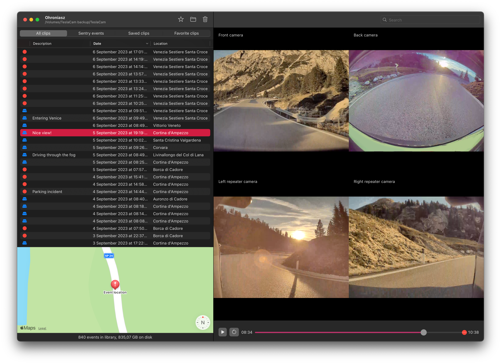

# Ohroniasz
Simple, native MacOS app for managing the library of TeslaCam videos.

> [!WARNING]
> This app is still under development. While I use it myself and find it stable, it's a good idea to back up your data before using it.

# ⚙️ Features
- Adding custom descriptions to events.
- Marking specific events as "favorites".
- Filtering events by their type (Sentry clips, saved clips, favorites).
- Displays selected event location on a map.
- Searching events by description.
- Nice performance, even with large libraries.

# 🚧 Development
Just open the project in latest Xcode 🤷‍♀️.

There are no external dependencies. Most of the UI code is done using SwiftUI.

## 🪵 Changelog
You can read the project changelog [here](CHANGELOG.md).

## 📝 License
This project is licensed under the [MIT license](LICENSE).
